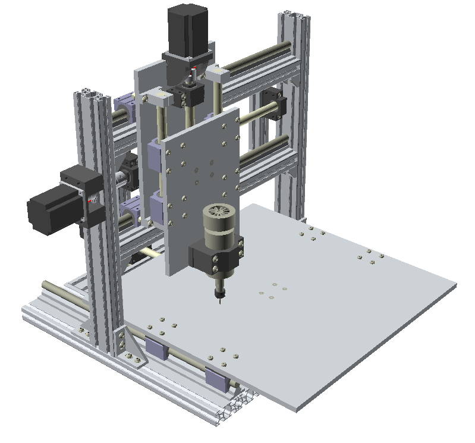

# CNC_OpenSCAD
Complete parametric model of CNC machine.

> Warning: this model is for prototyping, playing a bit with parameters and ordering main parts. Some elements are missing because they are not important at this step.

Main dimensions are in [CNC_dim.scad](CNC_dim.scad). You can get a BOM by simply running the [generate_bom.py](generate_bom.py) script:
```console
./generate_bom.py CNC.scad
```

Black parts (mostly motor holders and spacers) are 3D-printed.


